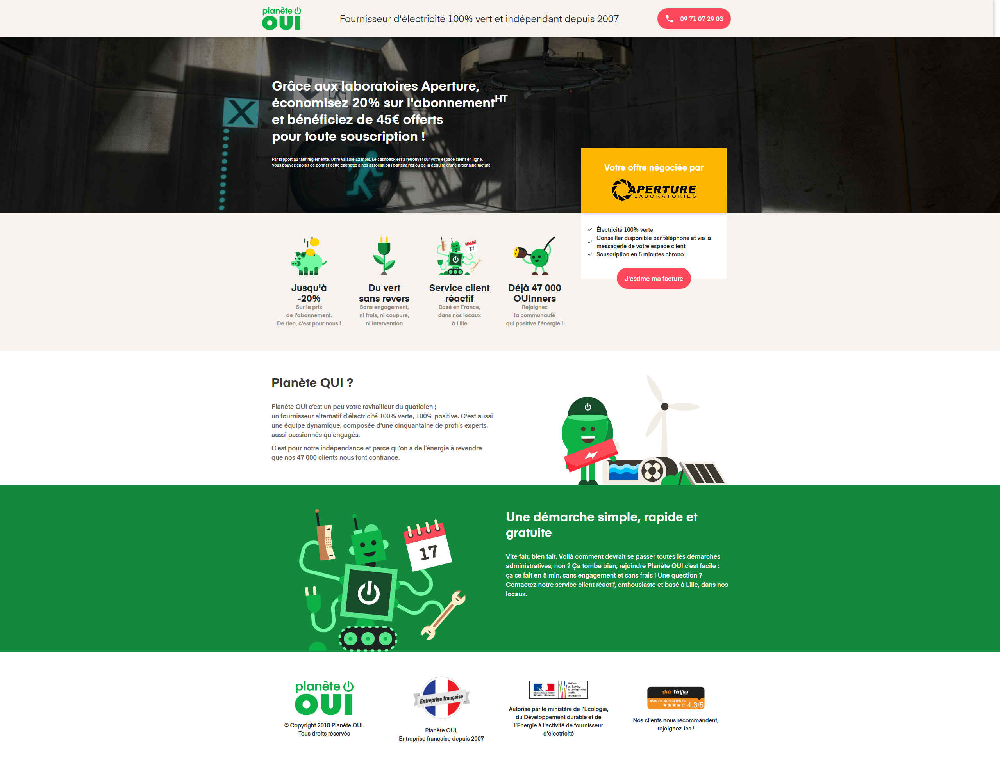
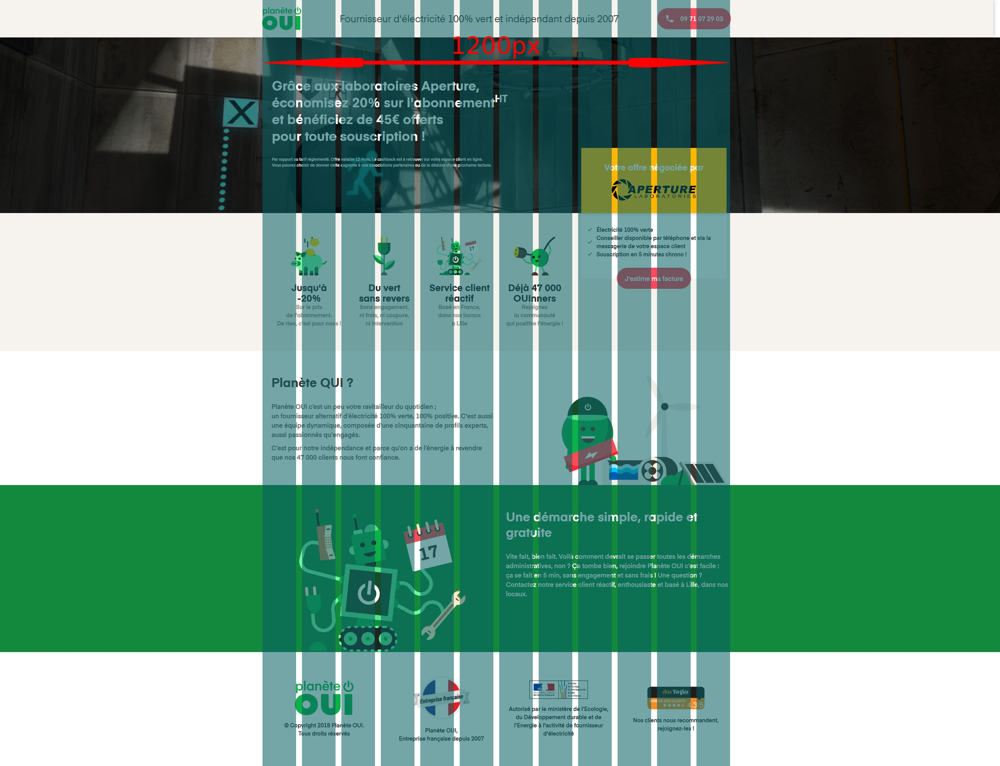

# HTML / SCSS / JS Test

The goal of this test is to reproduce the following design. 



Here is the version with the grid



## Commands
### Init project

```
λ npm i
```

### Launch in dev mode

```
λ npm run dev
```
Will watch for changes in `dist` folder

### Build for production

```
λ npm run build
```

## Files

```
.
├── assets
│   ├── fonts  // Fonts already included
│   ├── images // Images already included
│   ├── js
│   │   └── app.js
│   └── styles
|       └── _fonts.scss
│       └── app.scss
├── index.html // Includes Bootstrap 4 via CDN
├── gulpfile.js
├── package.json
└── .babelrc
```

## To do

Use `index.html` and `app.scss` to build the page showed in `layout.jpg`.  
See `layout-with-grid.jpg` to get some hints on sizes.  
Take 1h30 / 2h to do as much as you can, we don't expect a 100% finalized nor pixel perfect work here.  
Just spare some time to write some js in `app.js`, just enough to make the gif included in `index.html` appear on click on an element (like the "J'estime ma facture" button) :)


## Hints
* All assets you need (fonts and images) are already in the `assets` folder
* Watch your class naming and inheritence
* Do not use jQuery for the JS part
* Bootstrap 4 is included via CDN, feel free to use it or not
# planete-oui
